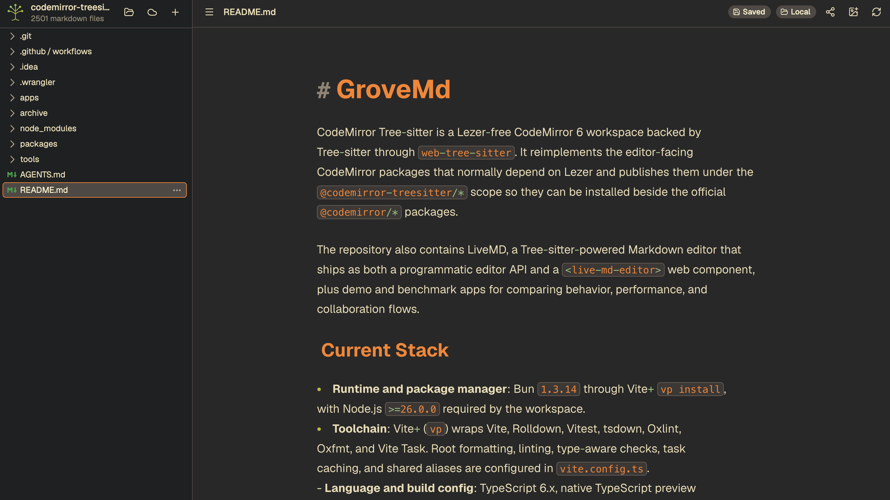

# GroveMd

GroveMd is a local-first Markdown workspace for writing directly from the files
you already own. Open a local folder in the browser, write in a Typora-style
live Markdown editor, and keep the source as plain `.md` files instead of
pushing notes through an app-specific storage model.



GroveMd is built for a small set of workflows that should stay simple:

- **Local first**: grant access to a folder, edit Markdown in place, autosave
  locally, and keep images beside the document in normal workspace assets.
- **Easy sync**: keep working from the local folder or connect a Dropbox-backed
  workspace when useful. Dropbox is the user-facing cloud flow through
  OpenDAL-backed browser storage.
- **No app install**: run the editor as a web app while still using browser
  file access for real local files.
- **Collaboration**: share a single file link through the Grove relay so guests
  can co-edit without access to the owner's local folder or cloud workspace.
- **Browser Agent**: use your own DeepSeek API key with
  `deepseek-v4-flash` by default, or manually select `deepseek-v4-pro`, to
  search and read the active workspace or apply version-checked edits to its
  Markdown documents. Multiple page-memory conversations can run in parallel
  and remain available from the Agent session switcher. The Agent orchestration
  and tools stay in the page.
- **Instant live Markdown**: headings, tables, task lists, code fences, KaTeX,
  Mermaid, and images render inline while the document remains editable.

Under the GroveMd app, this repository contains CodeMirror Tree-sitter, a
Lezer-free CodeMirror 6 workspace backed by Tree-sitter through
`web-tree-sitter`. It reimplements the editor-facing CodeMirror packages that
normally depend on Lezer and publishes them under the
`@codemirror-treesitter/*` scope so they can be installed beside the official
`@codemirror/*` packages.

The repository also contains LiveMD, a Tree-sitter-powered Markdown editor that
ships as both a programmatic editor API and a `<live-md-editor>` web component,
plus demo and benchmark apps for comparing behavior, performance, and
collaboration flows.

## Current Stack

- **Runtime and package manager**: Bun `1.3.14` through Vite+ `vp install`,
  with Node.js `>=26.0.0` required by the workspace.
- **Toolchain**: Vite+ (`vp`) wraps Vite, Rolldown, Vitest, tsdown, Oxlint,
  Oxfmt, and Vite Task. Root formatting, linting, type-aware checks, task
  caching, and shared aliases are configured in `vite.config.ts`.
- **Language and build config**: TypeScript 6.x, native TypeScript preview
  dependencies in packages, ES modules everywhere, shared `tsconfig.*` files,
  and package builds through `vp pack`.
- **Editor foundation**: Official `@codemirror/state`, `@codemirror/view`,
  `@codemirror/search`, and `@codemirror/lint` remain direct dependencies where
  Lezer is not part of the contract.
- **Parser layer**: `web-tree-sitter`, Tree-sitter grammar packages, bundled
  WASM assets, highlight queries, incremental reparsing, and included ranges
  for nested languages. The root package override currently points
  `web-tree-sitter` at `vendor/web-tree-sitter` so cursor range navigation uses
  the local binding patch documented in `vendor/web-tree-sitter/PATCH_NOTES.md`.
- **Markdown product layer**: LiveMD composes the local language, commands,
  autocomplete, basic setup, and language-data packages with KaTeX, Mermaid,
  and `beautiful-mermaid`. Host apps or theme packages provide concrete editor
  and code-fence highlighting themes.
- **Collaboration and workspace layer**: Optional LiveMD Loro bindings use
  `loro-crdt` and `loro-codemirror`. Grove's local workspace app supports local
  folders and Dropbox through the OpenDAL browser WASM wrapper,
  i18next/react-i18next UI localization, local image assets, and shared-file
  hosting. Grove's relay runs as the `grove-relay` Cloudflare Worker with
  Durable Object persistence, WebSocket sync, Wrangler, and the Cloudflare Vite
  plugin. The `collab-editor` app remains a separate Cloudflare collaboration
  demo.
- **Browser Agent layer**: Grove uses Vercel AI SDK Core with a lazy
  `@ai-sdk/deepseek` adapter fixed to `https://api.deepseek.com`. A
  user-provided key and a registry of independently running conversations
  remain in page memory while workspace tools list, read, and search Markdown
  and dispatch version-checked edits through workspace-owned Loro documents.
  DeepSeek's
  [disk context cache](https://api-docs.deepseek.com/guides/kv_cache/) runs by
  default, and its public API documents no client-side opt-out. DeepSeek
  documents per-user isolation and automatic cleanup of unused entries,
  typically within a few hours to days.

## Quickstart

```html
<body>
  <live-md-editor autofocus placeholder="Start writing..."></live-md-editor>
  <script type="module">
    import "@codemirror-treesitter/live-md/register";
  </script>
</body>
```

A single import registers the `<live-md-editor>` web component with
Tree-sitter-powered Markdown parsing, syntax highlighting, live Markdown
decorations, Shadow DOM styling, and host-provided theming. See
[Web Component](#web-component) for the full API.

The programmatic API exposes the same runtime without custom elements:

```ts
import { createLiveMdEditor } from "@codemirror-treesitter/live-md";

const editor = createLiveMdEditor({
  parent: document.body,
  placeholder: "Start writing...",
});

await editor.ready;
```

## What This Project Implements

- A Tree-sitter-backed replacement for the CodeMirror language layer, including
  `Language`, `LanguageSupport`, `LRLanguage`, `ParseContext`, syntax tree
  wrappers, language data facets, mixed-language parsing, highlighting,
  indentation, folding, bracket matching, bidi isolates, and stream-parser
  compatibility.
- A language-data registry that mirrors CodeMirror language metadata while
  lazily loading Tree-sitter WASM grammars and highlight queries.
- Lezer-free implementations of CodeMirror commands, autocompletion, close
  brackets, basic setup, merge views, LSP integration, and semantic editor
  themes.
- LiveMD, a Markdown editor runtime built from the local Tree-sitter packages,
  exposed through `createLiveMdEditor()`, `liveMarkdown()`,
  `liveMdCodeFenceHighlighting()`, `liveMdLinkOpen()`, `renderMarkdownToHtml()`,
  `liveMdMarkdownDocumentCss()`, `defineLiveMdEditor()`, and
  `<live-md-editor>`.
- Optional LiveMD collaboration bindings for Loro documents, presence, custom
  text containers, and collaborative undo/redo.
- A browser-resident Grove Markdown Agent with DeepSeek BYOK, bounded workspace
  list/read/search tools, parallel switchable page-memory conversations,
  streamed responses, and path-based exact edits through the workspace
  collaborative-document registry.
- Validation tooling and apps that check public export parity, package
  dependency boundaries, language-data coverage, example coverage, benchmark
  coverage, and runtime behavior against official CodeMirror/Lezer packages.

The implementation packages intentionally do not depend on Lezer. The examples
app is the comparison surface and is allowed to depend on official CodeMirror
and Lezer packages so it can compare local behavior with upstream behavior side
by side.

## Architecture

The workspace keeps the official CodeMirror editor primitives where Lezer is
not part of the contract: `@codemirror/state`, `@codemirror/view`,
`@codemirror/search`, and `@codemirror/lint` are used directly. The packages in
this repository replace the language-aware layers above those primitives.

1. **Tree-sitter language runtime**:
   `@codemirror-treesitter/language` adapts `web-tree-sitter` into
   CodeMirror's language interfaces. It owns parser scheduling, incremental
   parsing, syntax-tree wrappers, nested parsing, syntax highlighting,
   indentation, folding, bracket matching, bidi isolation, and stream-parser
   support. The workspace override uses the vendored `web-tree-sitter` runtime
   in `vendor/web-tree-sitter` until the cursor range navigation binding fix is
   available upstream.
2. **Language registry**:
   `@codemirror-treesitter/language-data` builds `LanguageDescription` entries
   on top of the language runtime. Each entry owns aliases, filename and
   extension metadata, WASM grammar loading, optional highlight-query loading,
   language data, and nested parser setup.
3. **Editor feature packages**:
   `commands`, `autocomplete`, `merge`, and `lsp-client` reimplement the
   CodeMirror feature packages that need syntax information. They depend on the
   local language runtime instead of `@codemirror/language` or Lezer.
4. **Assembly and styling**:
   `basic-setup` assembles a CodeMirror setup from local feature packages,
   `theme` defines shared semantic theme helpers, and concrete theme packages
   provide editor themes and highlight styles using local highlight tags.
5. **Product surface**:
   `live-md` composes the local packages into a Markdown editor with live block
   widgets, code-fence highlighting, KaTeX and Mermaid rendering, Shadow DOM
   web component integration, persistence, selection APIs, a unified
   `LiveMdConfig` entry point for Markdown features and host plugins, and
   benchmark fixtures.
6. **Workspace and collaboration surface**:
   `live-md-loro` provides optional CRDT bindings, `apps/local-md-workspace`
   provides the Grove local/cloud Markdown workspace and shared-file host or
   guest UI, `apps/grove-relay` hosts Grove shared-file relay APIs with
   Cloudflare Durable Objects and WebSocket transport, and `apps/collab-editor`
   remains a separate shareable collaborative editor demo.
7. **Browser Agent surface**:
   Local MD Workspace owns a provider-neutral Agent host and a lazy Vercel AI
   SDK `@ai-sdk/deepseek` adapter fixed to `https://api.deepseek.com`.
   `deepseek-v4-flash` is the default, and `deepseek-v4-pro` is the only model
   the user can select manually. Independent conversation controllers allow
   concurrent runs and session switching without aborting background work.
   Reads go through the active `WorkspaceRuntime`; writes dispatch exact edits
   through workspace-owned collaborative documents so the main Loro peer,
   ordinary undo, and existing persistence paths remain authoritative.

## Workspace Structure

| Path              | Purpose                                                                                               |
| ----------------- | ----------------------------------------------------------------------------------------------------- |
| `package.json`    | Private Bun/Vite+ workspace, catalog versions, root scripts, and engine constraints.                  |
| `vite.config.ts`  | Shared Vite+ config for aliases, formatting, linting, type-aware checks, and run caching.             |
| `vite.shared.ts`  | Workspace import aliases used by packages and apps during local development.                          |
| `tsconfig*.json`  | Shared TypeScript settings for package and app builds.                                                |
| `packages/*`      | Workspace `@codemirror-treesitter/*` implementation and experimental packages.                        |
| `apps/*`          | Local browser, benchmark, comparison, Grove, relay, demo, and Cloudflare collaboration apps.          |
| `tools/audit.mjs` | Repository audit for package names, Lezer-free boundaries, upstream parity, coverage, and app wiring. |
| `bun.lock`        | Bun lockfile generated by `vp install`.                                                               |

## Packages

| Directory                           | Package                                           | Role                                                                                                                                    |
| ----------------------------------- | ------------------------------------------------- | --------------------------------------------------------------------------------------------------------------------------------------- |
| `packages/language`                 | `@codemirror-treesitter/language`                 | Tree-sitter parser integration and CodeMirror-compatible language infrastructure.                                                       |
| `packages/language-data`            | `@codemirror-treesitter/language-data`            | Lazy language metadata, Tree-sitter WASM loading, highlight-query loading, and mixed-language parser wiring.                            |
| `packages/commands`                 | `@codemirror-treesitter/commands`                 | Cursor movement, selection, deletion, indentation, commenting, history, and keymaps.                                                    |
| `packages/autocomplete`             | `@codemirror-treesitter/autocomplete`             | Completion contexts, sources, results, tooltip UI, filtering, snippets, word completion, and close brackets.                            |
| `packages/codemirror`               | `@codemirror-treesitter/basic-setup`              | `basicSetup` and `minimalSetup` assembled from the local Tree-sitter packages.                                                          |
| `packages/theme-palettes`           | `@codemirror-treesitter/theme-palettes`           | Shared concrete color palettes reused by CodeMirror and LiveMD presentation theme packages.                                             |
| `packages/theme`                    | `@codemirror-treesitter/theme`                    | Shared semantic theme token contracts and CodeMirror editor/highlight extension factories.                                              |
| `packages/theme-gruvbox`            | `@codemirror-treesitter/theme-gruvbox`            | Gruvbox dark/light editor themes, highlight styles, combined extensions, and palettes.                                                  |
| `packages/theme-github`             | `@codemirror-treesitter/theme-github`             | GitHub Light editor theme, highlight style, combined extension, and palette export.                                                     |
| `packages/theme-catppuccin`         | `@codemirror-treesitter/theme-catppuccin`         | Catppuccin Latte/Macchiato editor themes, highlight styles, combined extensions, and palette exports.                                   |
| `packages/merge`                    | `@codemirror-treesitter/merge`                    | Diff, split merge view, unified merge view, chunks, and accept/reject commands.                                                         |
| `packages/lsp-client`               | `@codemirror-treesitter/lsp-client`               | LSP client, workspace mapping, diagnostics, completions, hover, formatting, rename, definition, references, and signature help.         |
| `packages/live-md`                  | `@codemirror-treesitter/live-md`                  | Live Markdown editor runtime, unified config API, web component, registration entry, fixtures, Markdown HTML renderer, and CSS exports. |
| `packages/live-md-theme`            | `@codemirror-treesitter/live-md-theme`            | Reusable LiveMD presentation token contract and helpers for applying `--live-md-*` variables.                                           |
| `packages/live-md-theme-gruvbox`    | `@codemirror-treesitter/live-md-theme-gruvbox`    | Gruvbox dark/light LiveMD prose, widget, table, Mermaid, and code-block container presentation themes.                                  |
| `packages/live-md-theme-github`     | `@codemirror-treesitter/live-md-theme-github`     | GitHub Light LiveMD presentation theme.                                                                                                 |
| `packages/live-md-theme-catppuccin` | `@codemirror-treesitter/live-md-theme-catppuccin` | Catppuccin Latte/Macchiato LiveMD presentation themes.                                                                                  |
| `packages/live-md-loro`             | `@codemirror-treesitter/live-md-loro`             | Optional Loro collaboration bindings for LiveMD documents, presence, custom text containers, direct actor edits, and undo/redo.         |
| `packages/opendal-wasm-browser`     | `@codemirror-treesitter/opendal-wasm-browser`     | Experimental browser WASM wrapper for OpenDAL-backed cloud workspace storage.                                                           |

Each package directory has its own README with local responsibilities, public
entry points, dependency boundaries, source layout, and validation notes.

## Apps and Tools

- `apps/basic-editor`: Minimal Tree-sitter-only editor that imports
  `@codemirror-treesitter/live-md/register` and renders one
  `<live-md-editor>` element.
- `apps/local-md-workspace`: Grove React, Vite+, shadcn/radix local-first
  Markdown workspace that opens a browser-granted local folder, edits `.md`
  files with LiveMD, supports Dropbox storage through OpenDAL WASM and OAuth PKCE,
  supports image insert/paste/drop through sibling `assets/` directories,
  supports file/folder create, rename, delete, tree browsing, and autosave, can
  export standalone HTML or open a browser print view for saving as PDF with
  scoped LiveMD document styling, can host or join Grove shared-file sessions
  through `apps/grove-relay`, and includes a browser-resident DeepSeek BYOK
  Agent for workspace Markdown listing, search, path-based reads, and exact edits.
- `apps/grove-relay`: Grove shared-file relay Worker with Durable Object
  persistence, share create/session/rotate/revoke APIs, WebSocket Loro sync,
  bounded relay queues, share expiration cleanup, and Wrangler deploy/types
  tasks.
- `apps/examples`: Side-by-side workbench comparing the local Tree-sitter
  implementation with official CodeMirror/Lezer behavior on parser-relevant
  examples, package coverage, merge/LSP behavior, and benchmark metrics.
- `apps/live-md-benchmark`: LiveMD performance benchmark harness for rendering,
  editing, deletion, clipboard, and selection workflows.
- `apps/live-md-loro-demo`: Two-peer LiveMD collaboration demo with simulated
  latency, offline queueing, and Loro snapshot resync.
- `apps/collab-editor`: Cloudflare Workers app with a Durable Object room,
  WebSocket Loro sync, local snapshot recovery, hash-based room URLs,
  standalone share lifecycle APIs, and deployment/types tasks through Wrangler.
- `tools/audit.mjs`: Repository audit that checks package names, Lezer-free
  guarantees, public export parity, command and autocomplete stubs, basic setup
  parity, language-data metadata/load coverage, example coverage, merge/LSP
  usage, and benchmark app wiring.

## Web Component

The `<live-md-editor>` custom element wraps a Tree-sitter-backed CodeMirror
Markdown editor in Shadow DOM. Import the register entry point once, then use
the element anywhere in your HTML.

```ts
import "@codemirror-treesitter/live-md/register";
import "@codemirror-treesitter/live-md/style.css";
```

### Attributes

| Attribute       | Type    | Description                                                                    |
| --------------- | ------- | ------------------------------------------------------------------------------ |
| `autofocus`     | boolean | Focus the editor when it connects to the DOM.                                  |
| `default-value` | string  | Initial Markdown content. If omitted, trimmed light-DOM `textContent` is used. |
| `persist-key`   | string  | `localStorage` key for persisting editor content.                              |
| `placeholder`   | string  | Placeholder text when the editor is empty.                                     |
| `readonly`      | boolean | Disable editing while keeping content selectable/readable.                     |

### Properties

| Property         | Type                 | Description                                                              |
| ---------------- | -------------------- | ------------------------------------------------------------------------ |
| `value`          | `string`             | Current Markdown content, read/write.                                    |
| `defaultValue`   | `string`             | Initial content, read/write.                                             |
| `persistKey`     | `string \| null`     | `localStorage` key, read/write.                                          |
| `placeholder`    | `string`             | Placeholder text, read/write.                                            |
| `readOnly`       | `boolean`            | Whether the editor is read-only, read/write.                             |
| `dirty`          | `boolean`            | Whether content has changed since `markClean()`.                         |
| `selectionStart` | `number`             | Selection anchor position, read/write.                                   |
| `selectionEnd`   | `number`             | Selection head position, read/write.                                     |
| `view`           | `EditorView \| null` | The underlying CodeMirror `EditorView` instance.                         |
| `config`         | `LiveMdConfig`       | JavaScript-only Markdown feature and host plugin configuration.          |
| `extensions`     | `Extension`          | Optional direct CodeMirror extensions configured from JavaScript.        |
| `ready`          | `Promise<void>`      | Resolves after Markdown support is ready; fence grammars load on demand. |

### Methods

| Method                          | Description                                       |
| ------------------------------- | ------------------------------------------------- |
| `focus()`                       | Focus the editor.                                 |
| `blur()`                        | Blur the editor.                                  |
| `markClean()`                   | Mark current content as clean, resetting `dirty`. |
| `setSelectionRange(start, end)` | Programmatically set the selection range.         |
| `select()`                      | Select all content.                               |

### Events

| Event           | Detail      | Description                                                   |
| --------------- | ----------- | ------------------------------------------------------------- |
| `input`         | -           | Fires on every content change and bubbles through Shadow DOM. |
| `change`        | -           | Fires after blur when content changed since the last blur.    |
| `live-md-ready` | `{ view }`  | Fires when async editor setup completes.                      |
| `live-md-error` | `{ error }` | Fires if editor initialization or async setup fails.          |
| `select`        | -           | Fires when the selection changes through user selection APIs. |

### CSS Custom Properties

The editor styles are installed into the Shadow DOM and can be themed with CSS
custom properties on the host element.

| Property                | Description                                                    |
| ----------------------- | -------------------------------------------------------------- |
| `--live-md-bg`          | Editor background.                                             |
| `--live-md-text`        | Primary text color.                                            |
| `--live-md-muted`       | Secondary text and widget label color.                         |
| `--live-md-accent`      | Primary accent for links, checks, focus, and Mermaid defaults. |
| `--live-md-accent-2`    | Secondary accent used by the caret and emphasis details.       |
| `--live-md-border`      | Border color for widgets and block surfaces.                   |
| `--live-md-code-bg`     | Code block and inline-code background.                         |
| `--live-md-code-text`   | Code text color.                                               |
| `--live-md-code-muted`  | Code gutter/header muted color.                                |
| `--live-md-code-border` | Code block border color.                                       |
| `--live-md-font-body`   | Markdown body font stack.                                      |
| `--live-md-font-ui`     | UI and widget label font stack.                                |
| `--live-md-font-code`   | Code font stack.                                               |
| `--live-md-mermaid-*`   | Optional Mermaid-specific color and font overrides.            |

## Programmatic API

```ts
import {
  createLiveMdEditor,
  liveMdImageAssets,
  liveMdLinkBehavior,
  liveMdMarkdownFeature,
  liveMdTheme,
} from "@codemirror-treesitter/live-md";
import { gruvboxDarkLiveMdTheme } from "@codemirror-treesitter/live-md-theme-gruvbox";
import { gruvboxDark } from "@codemirror-treesitter/theme-gruvbox";

const imageAssetUrlMap = new Map<string, string>();
const callouts = liveMdMarkdownFeature({
  name: "callouts",
  query: "(block_quote) @html",
  async renderHtml({ renderDefault, slice, target }) {
    if (!slice(target).startsWith("> [!")) return null;
    return `<aside class="callout">${await renderDefault()}</aside>`;
  },
});
const controller = createLiveMdEditor({
  parent: document.body,
  defaultValue: "# Draft",
  config: {
    markdown: {
      features: [callouts],
    },
    plugins: [
      liveMdTheme({
        editor: gruvboxDark,
        theme: gruvboxDarkLiveMdTheme,
      }),
      liveMdImageAssets({
        resolve(source) {
          return imageAssetUrlMap.get(source) ?? source;
        },
      }),
      liveMdLinkBehavior({
        baseUrl: "https://docs.example/notes/current.md",
      }),
    ],
  },
  placeholder: "Start writing...",
  persistKey: "draft",
  onChange({ value }) {
    console.log(value);
  },
});

await controller.ready;
controller.setReadOnly(false);
controller.setValue("# Updated");
controller.destroy();
```

`createLiveMdEditor()` accepts `value`, `doc`, `defaultValue`, `persistKey`,
`placeholder`, `readOnly`, `autofocus`, `focus`, `root`, `config`,
`extensions`, `imageSource`, `linkBaseUrl`, `onChange`, and `onBlur`.
`config.markdown.features` is the query-driven Markdown syntax layer for editor
decorations and block-level HTML export hooks. `renderHtml(...)` queries the
block tree only; a feature's `includeNested` setting only affects editor
`decorate(...)` queries. Editor `decorate(...)` hooks still run inside an active
LiveMD source island; built-in destructive replacements are suppressed by the
active source range, while custom features use `activeLines` and
`rangeTouchesActiveLine(...)` when they need active-source-specific behavior.
`config.plugins` is the host behavior layer for CodeMirror extensions and
lifecycle hooks such as theme, image asset, link behavior, or collaboration
integration. Markdown syntax
extensions are called features, not plugins. The controller exposes `view`,
`value`, `ready`, `setValue()`, `setConfig()`, `setExtensions()`,
`setPersistKey()`, `setPlaceholder()`, `setReadOnly()`, and `destroy()`.
The v3 LiveMD baseline is a full-document correctness reset, not a performance
improvement. The old viewport/dirty-range feature API was removed:
`LiveMdFeatureDecorateContext` no longer exposes `ranges`, and
`LiveMdFeatureDocRange` is no longer exported. Query-driven features should use
their matched syntax plus `activeLines` and `rangeTouchesActiveLine(...)` for
active-line-specific behavior.
Blank lines are ordinary editable Markdown text. In a normal paragraph,
`Enter` and `Shift+Enter` both insert one newline; their behavior differs only
inside structural Markdown contexts, where `Enter` keeps list, task-list, and
blockquote continuation while `Shift+Enter` inserts a raw newline.
`extensions` remains the direct CodeMirror escape hatch and is applied after
plugin extensions. `imageSource` and `linkBaseUrl` remain available for simple
hosts, but package-style integrations should prefer `config.plugins`.
`imageSource` may return a URL string or `{ src, width, height }` when a host
knows preview image dimensions. Link jumps open in a new browsing context by
default; use `liveMdLinkOpen(handler)` through `extensions` for custom
navigation or `liveMdLinkBehavior(...)` through `config.plugins` for
plugin-style link base configuration. Fenced code token colors reuse the active
CodeMirror syntax highlighters from `extensions`.
`liveMdCodeFenceHighlighting(...)` remains available for hosts that need an
explicit fenced-code override.

## Optional Loro Collaboration

Install `@codemirror-treesitter/live-md-loro` when a LiveMD editor should bind
to a Loro CRDT document. The default LiveMD package does not import Loro.

```ts
import { createLiveMdEditor } from "@codemirror-treesitter/live-md";
import {
  commitLiveMdLoroExternalEdit,
  liveMdLoroCollaborationPlugin,
} from "@codemirror-treesitter/live-md-loro";
import { LoroDoc } from "loro-crdt";

const doc = new LoroDoc();
const text = doc.getText("markdown");
text.insert(0, "# Shared document");
doc.commit();
text.free();

createLiveMdEditor({
  parent: document.body,
  config: {
    plugins: [liveMdLoroCollaborationPlugin({ doc })],
  },
});

const actorText = doc.getText("markdown");
actorText.insert(actorText.length, "\nEdited by another local actor.");
commitLiveMdLoroExternalEdit(doc);
actorText.free();
```

Web Component users opt in through the JavaScript-only `config` property:

```ts
const editor = document.createElement("live-md-editor");
editor.config = {
  plugins: [liveMdLoroCollaborationPlugin({ doc })],
};
document.body.append(editor);
```

The collaboration helper also supports custom Loro text containers, presence
through `EphemeralStore`, and optional Loro undo managers. String text keys use
short-lived handles owned by the adapter. Handles returned by custom getters or
the low-level text helper exports remain caller-owned and must stay valid while
the editor uses them.

Use `commitLiveMdLoroExternalEdit(...)` for direct application-actor mutations
of a bound Loro document. It projects that local Loro transaction into bound
CodeMirror views without echoing the view update back into the CRDT.

## Implementation Notes

- Tree-sitter incremental reparsing edits the previous `Tree` with CodeMirror
  change data and passes the edited tree back into `Parser.parse(...)`.
- Parsing honors CodeMirror-style time budgets through Tree-sitter's
  `progressCallback`, allowing large parses to stop and resume.
- Mixed-language parsing uses Tree-sitter `includedRanges` for nested regions.
  HTML and Vue currently nest JavaScript in `<script>` blocks and CSS in
  `<style>` blocks, and nested parser sources can defer async parser loads via
  `ParseContext.getSkippingParser(...)`.
- `language-data` lazy-loads grammar WASM files and published highlight
  queries, so `LanguageDescription.load()` only resolves assets needed for the
  selected language.
- The syntax tree wrapper preserves CodeMirror-facing names such as `Tree`,
  `SyntaxNode`, `NodeType`, and `TreeCursor`, while exposing
  Tree-sitter-backed navigation, status, field, descendant, and error helpers.
- `HighlightStyle`, `syntaxHighlighting`, `tags`, and `tagHighlighter` are
  implemented locally and map Tree-sitter capture names into CodeMirror-style
  highlight tags.
- Indentation, folding, bracket matching, bidi isolates, comment tokens, and
  stream-parser language support are implemented without Lezer.
- Some upstream `language-data` entries that only have legacy stream modes are
  covered with compact in-repo grammar/style shims.
- `grove-relay` persists Durable Object snapshots and bounded update logs for
  Grove shared files. `collab-editor` keeps the separate generated-room demo
  behavior.

## Parity Targets

The goal is source-compatible behavior for the CodeMirror surfaces this
workspace reimplements, not identical internals. `tools/audit.mjs` enforces the
main contract:

- `@codemirror-treesitter/language` exports every public name from upstream
  `@codemirror/language`'s index and exposes local Tree-sitter highlight
  helpers.
- `@codemirror-treesitter/commands` exports every public name from upstream
  `@codemirror/commands`, `comment`, and `history`, and does not leave known
  no-op command placeholders.
- `@codemirror-treesitter/autocomplete` exports every public name from upstream
  `@codemirror/autocomplete`, and does not leave known completion-context
  placeholders.
- `@codemirror-treesitter/basic-setup` matches upstream `basicSetup`,
  `minimalSetup`, and basic keymap ordering.
- `@codemirror-treesitter/language-data` mirrors upstream language metadata and
  all built language entries load a parser.
- `@codemirror-treesitter/theme` exports shared semantic theme helpers built on
  the local Tree-sitter highlight tags.
- Concrete theme packages such as `theme-gruvbox`, `theme-github`, and
  `theme-catppuccin` export CodeMirror themes and LiveMD-ready nested
  code-fence bundles without duplicating the shared selector or tag mapping.
- `@codemirror-treesitter/merge` and
  `@codemirror-treesitter/lsp-client` expose upstream-compatible public
  surfaces and use the local Tree-sitter language/highlighting packages.
- Parser-relevant official examples are implemented in `apps/examples` or
  explicitly classified as out of scope.

## Development

Use Vite+ from the workspace root:

```bash
vp install
vp check
vp run -r test
vp run -r build
vp run audit
```

The recursive test task includes the OpenDAL browser wrapper's host Rust unit
regressions as well as the TypeScript test suites.

The root script `vp run ready` runs the full local validation path:

```bash
vp run ready
```

Useful task selectors:

```bash
vp run verify:web-tree-sitter
vp run @codemirror-treesitter/language#test
vp run @codemirror-treesitter/live-md#build
vp run @codemirror-treesitter/opendal-wasm-browser#auth:dropbox-token
vp run @codemirror-treesitter/opendal-wasm-browser#validate:dropbox
vp run local-md-workspace#dev
vp run local-md-workspace#bundle:check
vp run local-md-workspace#i18n:check
vp run local-md-workspace#test
vp run local-md-workspace#smoke:agent
vp run local-md-workspace#smoke:ui
vp run grove-relay#dev
vp run grove-relay#test
vp run grove-relay#types
vp run examples#dev
vp run live-md-benchmark#benchmark
vp run live-md-loro-demo#dev
vp run collab-editor#dev
vp run collab-editor#test
vp run collab-editor#types
```

`vp run` with no task lists all available package and app tasks.

`vp run local-md-workspace#dev` starts both the local Markdown workspace
frontend and the local `apps/grove-relay` shared-file relay. The default relay
origin is `http://127.0.0.1:8787`, and the frontend receives it through
`VITE_LOCAL_MD_SHARE_RELAY_ORIGIN`. Run `vp dev` from
`apps/local-md-workspace` or `vp run local-md-workspace#dev:frontend` only when
you intentionally want the frontend without the local relay. To test against a
deployed relay in local dev, pass
`vp run local-md-workspace#dev -- --relay-origin <deployed relay origin>`.

Production Grove deploys use the Cloudflare Pages project `grove` at
`https://app.grovemd.net`, with `https://grovemd.net` redirecting to that app
origin, and the `grove-relay` Worker custom domain at
`https://relay.grovemd.net`. The Grove CI/CD workflow enforces
`VITE_DROPBOX_REDIRECT_URI=https://app.grovemd.net/` for Dropbox OAuth and builds
the frontend against the relay custom domain. OneDrive and Google Drive provider
adapters exist in source but are not exposed in the current Grove UI. It also runs
`vp run local-md-workspace#i18n:check` to verify English/Chinese message keys and
placeholders before tests. CI deploys the relay Worker with
`apps/grove-relay/wrangler.worker.ci.jsonc`; the custom-domain route is kept in
`apps/grove-relay/wrangler.worker.jsonc` for one-time provisioning by a token with
zone route permissions.

`vp run local-md-workspace#smoke:ui` expects the local Markdown workspace dev
server to be running at `http://127.0.0.1:5173/` by default. Start that dev
server with a Dropbox app key, for example
`VITE_DROPBOX_APP_KEY=smoke-dropbox-app`, so the credential-free mock Dropbox
workspace smoke can enter through the normal OAuth UI. It runs without cloud
credentials for the local workspace and mock Dropbox workspace checks. To include
the credential-gated real Dropbox app flow, set
`LOCAL_MD_WORKSPACE_DROPBOX_ACCESS_TOKEN` or `OPENDAL_DROPBOX_ACCESS_TOKEN`;
`LOCAL_MD_WORKSPACE_DROPBOX_ROOT` can limit the temporary smoke file to a
specific Dropbox workspace root. These access-token variables are only for local
smoke tests that need to exercise real Dropbox file IO. They are not product
configuration, are not required for collaboration, and do not replace the
app's Dropbox OAuth flow. Set `CHROME_PATH` if Chromium is not available in a
standard app path or the Playwright browser cache.

## Documentation Map

- `AGENTS.md`: contributor and coding-agent workflow, stack snapshot,
  validation expectations, package boundaries, and app task notes.
- `packages/*/README.md`: package-local API, source layout, dependencies, and
  validation commands.
- `packages/live-md-loro/README.md`: optional collaboration binding docs.
- `packages/opendal-wasm-browser/README.md`: browser OpenDAL WASM wrapper API,
  build commands, and validation notes.
- `packages/opendal-wasm-browser/PLAN.md`: cloud workspace integration plan.
- `apps/local-md-workspace/COLLABORATION_PLAN.md`: owner-backed single-file
  collaboration plan, Dropbox workspace semantics, and cleanup/implementation
  phases.
- `apps/local-md-workspace/BROWSER_AGENT_PLAN.md`: browser Agent architecture,
  tool and edit contracts, budgets, and exclusions.
- `apps/local-md-workspace/COLLABORATIVE_DOCUMENT_MIGRATION.md`: collaborative
  document authority, lifecycle invariants, and stacked migration plan.
- This README: repository-level architecture, workspace structure, apps, and
  LiveMD web component/API reference.
